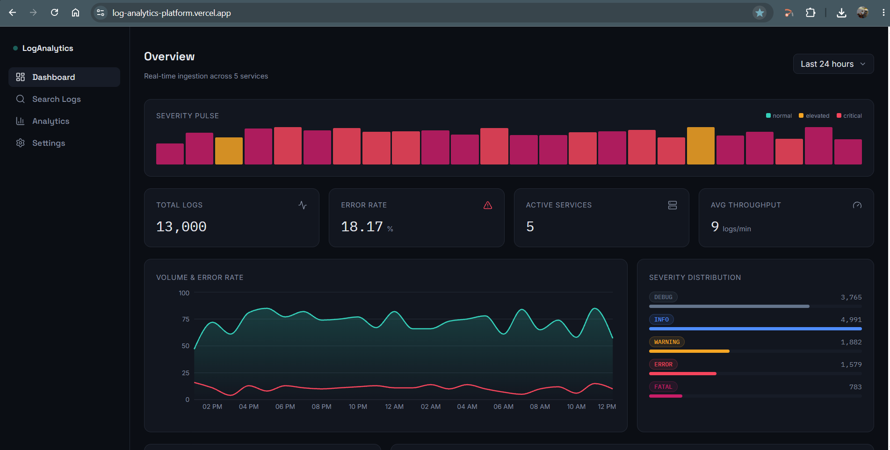
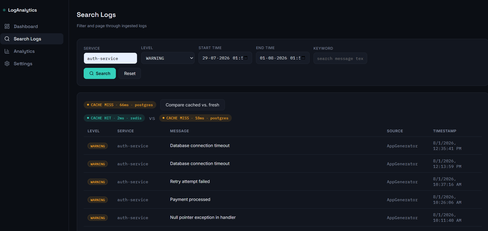
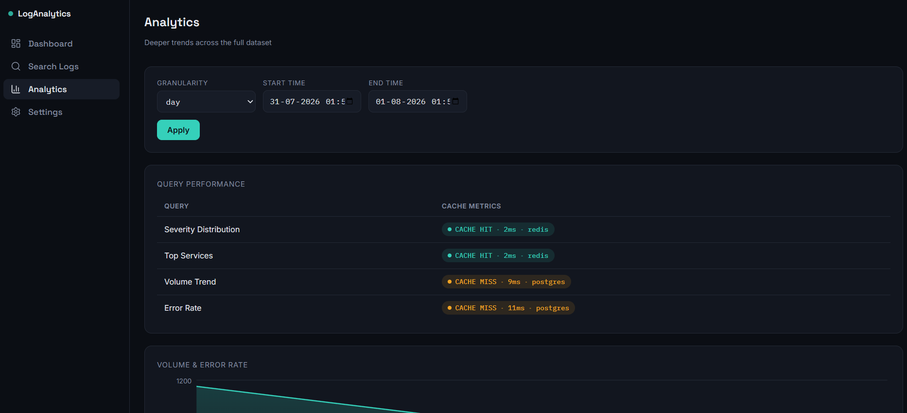
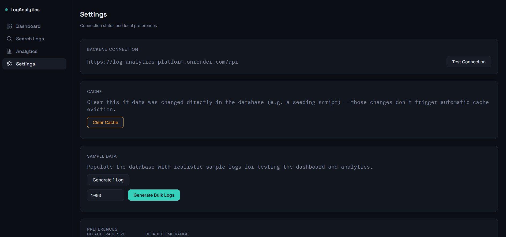
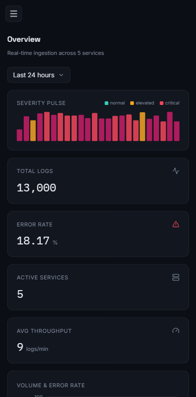

# Log Analytics Platform

A full-stack log ingestion and analytics platform built to explore real-world backend performance concerns — caching strategy, query optimization, and observable cache behavior — alongside a dashboard for visualizing log volume, severity trends, and error rates.

**Live demo:** [log-analytics-platform.vercel.app](https://log-analytics-platform.vercel.app/)
**API:** [log-analytics-platform.onrender.com](https://log-analytics-platform.onrender.com/) · [Swagger docs](https://log-analytics-platform.onrender.com/swagger-ui.html)

> Hosted on free tiers (Render, Vercel, Neon, Upstash) — the backend spins down after inactivity, so the first request after idle time may take 30–60s to wake up.

---

## Features

- **Log ingestion** — single and bulk log creation endpoints, with a client-side sample data generator (single + bulk, with injected error-spike windows) built into the app itself
- **Search & filtering** — filter by service, severity, time range, and keyword, with pagination
- **Analytics dashboard** — severity distribution, log volume trends, error-rate over time, and top services by error count
- **Redis caching with observability** — every search/analytics request reports cache hit/miss, response time, and data source (Redis vs. Postgres) directly in the UI, plus a "compare cached vs. fresh" tool to see the performance difference on the same query
- **Dockerized** — Postgres, Redis, backend, and frontend all run as a single stack via `docker-compose.yml`

## Tech Stack

**Backend:** Spring Boot 4, Spring Data JPA, Spring Data Redis, PostgreSQL, Redis, Lombok, springdoc-openapi
**Frontend:** React, Vite, Recharts, React Router
**Infra:** Docker, Docker Compose · Deployed on Render (backend), Vercel (frontend), Neon (Postgres), Upstash (Redis)

## Architecture

```
React (Vercel) → Spring Boot API (Render) → PostgreSQL (Neon)
                                    ↕
                              Redis (Upstash)
```

The backend uses a manual cache-aside pattern (rather than plain `@Cacheable`) specifically so it can report hit/miss status and timing back to the client via response headers (`X-Cache-Status`, `X-Response-Time-Ms`, `X-Data-Source`) — this is what powers the cache visualization in the UI.

## Screenshots

**Dashboard**


**Search Logs — cache hit/miss visualization**


**Analytics**


**Settings**


**Mobile View**


## Running Locally

### With Docker (recommended)

```bash
git clone https://github.com/pulkit2111/log-analytics-platform.git
cd log-analytics-platform
cp .env.example .env   # fill in your own values
docker compose up --build
```

- Frontend: `http://localhost`
- Backend: `http://localhost:8080`
- Swagger: `http://localhost:8080/swagger-ui.html`

### Without Docker

Requires Java 21, Node 20+, a local PostgreSQL instance, and a local Redis instance.

```bash
# backend
cd backend
./mvnw spring-boot:run

# frontend
cd frontend
npm install
npm run dev
```

## Environment Variables

| Variable | Description | Example |
|---|---|---|
| `DB_HOST` / `DB_PORT` / `DB_NAME` | Postgres connection | `localhost` / `5432` / `LogAnalyticsPlatform` |
| `DB_USERNAME` / `DB_PASSWORD` | Postgres credentials | |
| `DB_SSL_MODE` | `disable` locally, `require` for managed Postgres | `require` |
| `REDIS_HOST` / `REDIS_PORT` | Redis connection | |
| `REDIS_USERNAME` / `REDIS_PASSWORD` | Redis credentials (managed Redis only) | |
| `REDIS_SSL_ENABLED` | `true` for managed Redis (e.g. Upstash) | `true` |
| `DDL_AUTO` | Hibernate schema mode | `update` |
| `CORS_ALLOWED_ORIGIN` | Frontend origin allowed to call the API | `https://your-frontend.vercel.app` |
| `VITE_API_BASE_URL` | (frontend, build-time) backend API base URL | `https://your-backend.onrender.com/api` |

## API Overview

Full interactive documentation via Swagger at `/swagger-ui.html`. Key endpoints:

- `GET /api/searchLogs` — filtered, paginated log search
- `POST /api/addLogs` — bulk log ingestion
- `GET /api/analytics/severity-distribution`
- `GET /api/analytics/top-services`
- `GET /api/analytics/trend`
- `GET /api/analytics/error-rate`
- `POST /api/cache/clear` — manually clear all caches (useful after direct DB writes that bypass the API)

## Project Structure

```
.
├── backend/         # Spring Boot API
├── frontend/         # React (Vite) dashboard
└── docker-compose.yml
```

## Notes / Known Limitations
- Free-tier hosting involves occasional cold-start delays on the backend.
- Used Cron Job to ping the service every 5 minutes to prevent the cold start.
